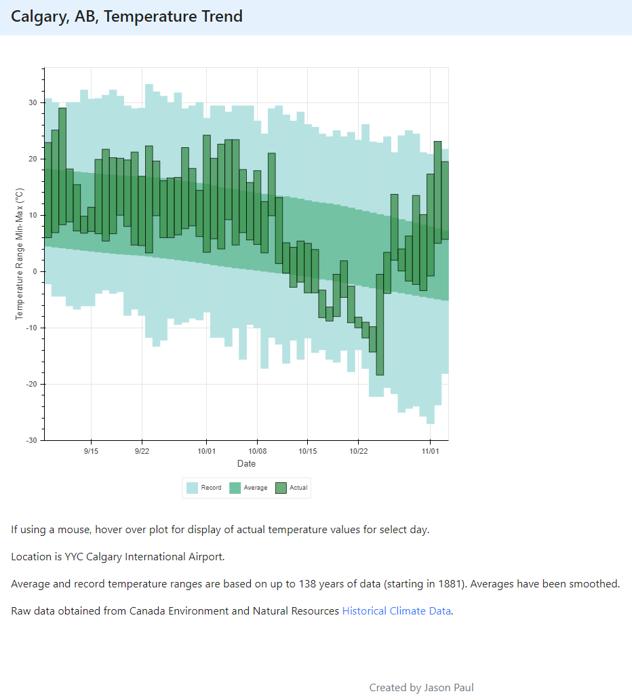
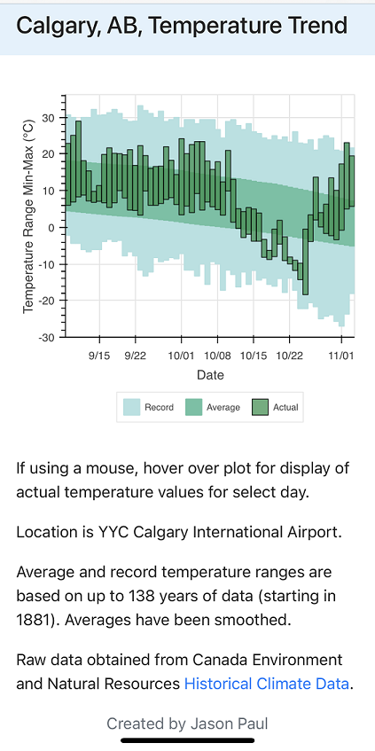

# django_weather_app
Weather (temperature) trend application written in Python Django.

### Description:
A web app that updates temperature statistics each day and renders a trend plot.

Tools used:
* Django backend
* Bootstrap frontend
* Pandas used for data retrieving and crunching
* PostgreSQL database
* Background task (apscheduler) for daily updates
* Deployed on Heroku

> Website:
https://yyc-weather-app.herokuapp.com/

Chrome image:

iPhone image:

